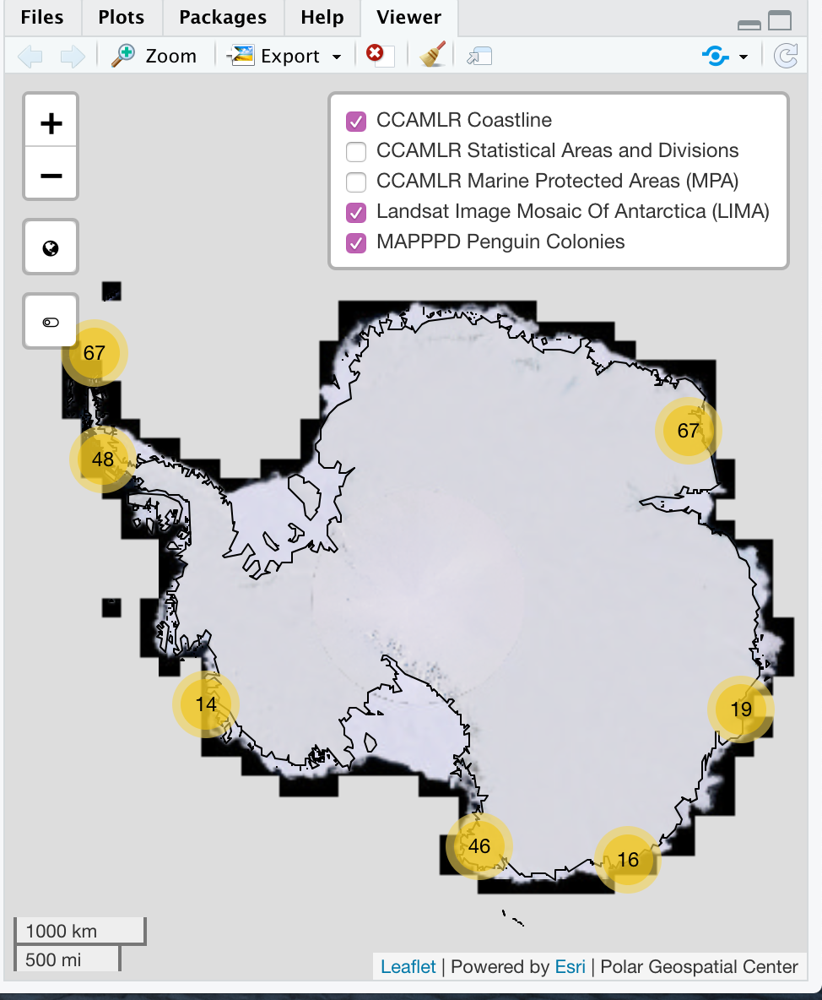

mapppdr
================

[](http://creativecommons.org/licenses/by/4.0/)[](https://www.gnu.org/licenses/lgpl-3.0)

### Antarctic Penguin Biogeography Project in R

<a href="http://www.penguinmap.com"></a>

The Antarctic Penguin Biogeography Project is an effort to collate all
known information about the distribution and abundance of Antarctic
penguins through time and to make such data available to the scientific
and management community. The core data product involves a series of
structured tables with information on known breeding sites and surveys
conducted at those sites from the earliest days of Antarctic exploration
through to the present. This database, which is continuously updated as
new information becomes available, provides a unified and comprehensive
repository of information on Antarctic penguin biogeography that
contributes to a growing suite of applications of value to the Antarctic
community (Che-Castaldo et al., 2023a). One such application is the
Mapping Application for Antarctic Penguins and Projected Dynamics
(MAPPPD; www.penguinmap.com), a browser-based search and visualization
tool designed specifically for the management community and other
non-specialists (Humphries et al., 2017), and as a Darwin Core archive
distributed through the Ocean Biodiversity Information System (OBIS) and
Global Biodiversity Information Facility (GBIF) clearing houses
(Che-Castaldo et al., 2023b). The `mapppdr` R package makes this
database more easily available to the scientific community by providing
its tables as data frames (one with simple features), along with the
BibTeX citation data as a bibentry object and the function `penmap` for
visualizing penguin breeding colony locations using `leaflet`. The
Antarctic Penguin Biogeography Project has been funded by the National
Aeronautics and Space Administration (NASA), the Pew Fellowship for
Marine Conservation, and the Institute for Advanced Computational
Science at Stony Brook University.

The package contains 12 data frames, 1 `BibEntry` object, and 1
function:

- `penguin_obs` - data frame containing all publicly available
  *Pygoscelis*, emperor, king and macaroni penguin counts and
  presence-absence data included in the APBP database at breeding sites
  south of 60 degrees S latitude
- `citations` - data frame containing bibliographic identifiers for all
  citations referenced in MAPPPD
- `sites` - data frame containing the name and location of all known
  *Pygoscelis*, emperor, king and macaroni penguin breeding sites south
  of 60 degrees S latitude and all Antarctic Site Inventory (ASI)
  penguin/seabird census sites included in the APBP database
- `sites_sf` - `sites` data frame with locations stored as simple
  features POINT geometries
- `species` - data frame containing the names of all penguin species
  included in the APBP database
- `site_species` - data frame linking *Pygoscelis*, emperor, king and
  macaroni penguin species to their breeding sites in the APBP database
- `articles` - data frame containing citation information specific to
  journal articles whose data are included in the APBP database
- `collections` - data frame containing citation information specific to
  books or conference proceedings containing data included in the APBP
  database
- `incollections` - data frame containing citation information specific
  to book chapters or conference papers whose data are included in the
  APBP database
- `unpublished` - data frame containing citation information specific to
  unpublished data included in the APBP database
- `persons` - data frame containing bibliographic identifiers for all
  people who contributed data to the APBP database
- `citation_persons` - data frame linking contributors to their
  citations in the APBP database
- `mapppd_bib` - `BibEntry` object containing bibliographic information
  for all citations in the APBP database
- `penmap` - function that creates a leaflet map of all known
  *Pygoscelis*, emperor, king and macaroni penguin breeding sites south
  of 60 degrees S latitude included in the APBP database

## Releases

- v2.4 (Oct X, 2023)

This database is licensed under a [Creative Commons Attribution 4.0
International License](http://creativecommons.org/licenses/by/4.0/).

All code is licensed under a [The GNU General Public License
v3.0](https://www.gnu.org/licenses/lgpl-3.0).

## Installation

You can install the latest version (2.4) from Github with:

``` r
install.packages('devtools')
devtools::install_github('CCheCastaldo/mapppdr', build_vignettes = TRUE)
```

### Vignette

Interacting with `mapppdr` is easily done using the following R packages
/ collections of packages. The first three (`tidyverse`, `RefManageR`,
and `sf`) are for manipulating the APBP data, while `htmlwidgets` is
useful for exporting penguin map leaflets (described below).

``` r
library(tidyverse)
library(RefManageR)
library(sf)
library(htmlwidgets)
```

#### Penguin Count Data

All counts and presence/absence data can be found in the `penguin_obs`
data frame. The `site_id` field references site information from the
`sites` or `sites_sf` data frames (the latter being just a simple
features version of the former). The `species_id` field references
species information from the `species` data frame. The `citekey` field
references bibliographic data that can be found in the `citations` data
frame and several different additional bibliographic data frames
(depending on the type of citation). The `citekey` also references the
cite key in the `mapppd_bib` bibentry object.

``` r
data(penguin_obs)
head(penguin_obs)
```

    ##   site_id species_id           citekey month day doy       date year season
    ## 1    ACUN       ADPE   coria2011laurie    NA  NA  NA       <NA> 1993   1993
    ## 2    ACUN       ADPE woehler1997status    NA  NA  NA       <NA> 1994   1994
    ## 3    ACUN       ADPE   coria2011laurie    NA  NA  NA       <NA> 2004   2004
    ## 4    ACUN       ADPE   lynch2014global     2  25  56 2011-02-25 2011   2010
    ## 5    ACUN       CHPE  poncet1985survey    12  28 362 1983-12-28 1983   1983
    ## 6    ACUN       CHPE   coria2011laurie    NA  NA  NA       <NA> 2004   2004
    ##    type presence count accuracy vantage
    ## 1 nests        1  2008        1  ground
    ## 2 nests        1  1920        1    <NA>
    ## 3 nests        1  1880        1  ground
    ## 4 nests        1  3079        5     vhr
    ## 5 nests        1  4000        4  ground
    ## 6 nests        1  7716        1  ground

It is easy to subset the data in various ways using the tidyverse. For
example, the following code returns all the chinstrap nest counts in
CCAMLR Sub area 48.2 from 1990 - 2000:

``` r
chinstrap_counts <- penguin_obs %>%
  dplyr::filter(type == "nests" & year %in% c(2000:2010) & species_id == "CHPE") %>%
  left_join(sites, by = "site_id") %>%
  dplyr::filter(ccamlr_id == "48.2")
head(chinstrap_counts)
```

    ##   site_id species_id         citekey month day doy date year season  type
    ## 1    ACUN       CHPE coria2011laurie    NA  NA  NA <NA> 2004   2004 nests
    ## 2    FERG       CHPE coria2011laurie    NA  NA  NA <NA> 2004   2004 nests
    ## 3    GEDD       CHPE coria2011laurie    NA  NA  NA <NA> 2004   2004 nests
    ## 4    LOLA       CHPE coria2011laurie    NA  NA  NA <NA> 2004   2004 nests
    ## 5    MILL       CHPE coria2011laurie    NA  NA  NA <NA> 2004   2004 nests
    ## 6    PAND       CHPE woehlerpersonal    NA  NA  NA <NA> 2009   2009 nests
    ##   presence count accuracy vantage           site_name               region
    ## 1        1  7716        1  ground        Acuna Island South Orkney Islands
    ## 2        1  7268        2  ground Ferguslie Peninsula South Orkney Islands
    ## 3        1  7116        2  ground         Cape Geddes South Orkney Islands
    ## 4        1   855        1  ground          Lola Point South Orkney Islands
    ## 5        1   886        1  ground           Mill Cove South Orkney Islands
    ## 6        1  2385        1  ground   Pandemonium Point South Orkney Islands
    ##   ccamlr_id  latitude longitude
    ## 1      48.2 -60.76120 -44.63700
    ## 2      48.2 -60.69300 -44.56700
    ## 3      48.2 -60.68500 -44.59000
    ## 4      48.2 -60.72385 -44.74222
    ## 5      48.2 -60.75300 -44.61400
    ## 6      48.2 -60.73600 -45.64800

You can also use spatial information to subset count data. This is quite
easy using the `sf` [package
tools](https://github.com/rstudio/cheatsheets/blob/master/sf.pdf). For
instance, the following code selects counts from the 22 sites whose
great circle distances are within 10 km of ACUN (including ACUN itself):

``` r
ACUN_area_counts <- sites_sf %>%
  mutate(ACUN_distance = as.numeric(sf::st_distance(sites_sf, sites_sf %>% 
    dplyr::filter(site_id == "ACUN")))) %>%
  dplyr::filter(ACUN_distance <= 10000) %>%
  dplyr::select(site_id) %>%
  inner_join(penguin_obs, by = "site_id")
st_geometry(ACUN_area_counts) <- NULL
glimpse(ACUN_area_counts)
```

    ## Rows: 56
    ## Columns: 14
    ## $ site_id    <chr> "ACUN", "ACUN", "ACUN", "ACUN", "ACUN", "ACUN", "ACUN", "AI…
    ## $ species_id <chr> "ADPE", "ADPE", "ADPE", "ADPE", "CHPE", "CHPE", "MCPE", "CH…
    ## $ citekey    <chr> "coria2011laurie", "woehler1997status", "coria2011laurie", …
    ## $ month      <int> NA, NA, NA, 2, 12, NA, NA, 12, 2, 12, 1, 12, 1, 12, NA, NA,…
    ## $ day        <int> NA, NA, NA, 25, 28, NA, NA, 28, 10, 28, 22, 28, 22, 28, NA,…
    ## $ doy        <int> NA, NA, NA, 56, 362, NA, NA, 362, 41, 362, 22, 362, 22, 362…
    ## $ date       <date> NA, NA, NA, 2011-02-25, 1983-12-28, NA, NA, 1983-12-28, 20…
    ## $ year       <int> 1993, 1994, 2004, 2011, 1983, 2004, 1993, 1983, 2020, 1983,…
    ## $ season     <int> 1993, 1994, 2004, 2010, 1983, 2004, 1993, 1983, 2019, 1983,…
    ## $ type       <chr> "nests", "nests", "nests", "nests", "nests", "nests", "nest…
    ## $ presence   <int> 1, 1, 1, 1, 1, 1, 1, 1, 1, 1, 1, 1, 1, 1, 1, 1, 0, 0, 1, 1,…
    ## $ count      <int> 2008, 1920, 1880, 3079, 4000, 7716, 2, 6000, 3000, 3300, 30…
    ## $ accuracy   <int> 1, 1, 1, 5, 4, 1, 1, 4, 5, 4, 5, 3, 5, 4, 2, 5, 1, 1, 4, 1,…
    ## $ vantage    <chr> "ground", NA, "ground", "vhr", "ground", "ground", "ground"…

#### Bibliographic Data

A core APBP project goal is to reliably report the observation metadata,
and in this regard we work very hard to make sure all data in the
database is properly cited and original data sources made easily
available to end-users. One challenge with the APBP database
bibliography is that fact that many of citations contain special
characters (accents, umlauts, etc.). To accomplish this we allow the
bibliographic data to retain accents through UTF-8 special.
Bibliographic data in `mapppdr` is stored in a set of data frames that
allow for easy subsetting of the actual observation data using the
`citekey` field. For instance. the following code returns all journal
articles containing penguin counts where Néstor R. Coria is an author,
before subsetting `penguin_obs` for the counts themselves.

``` r
coria_citations <- persons %>%
  dplyr::filter(family == "Coria" & given == "Néstor R.") %>%
  inner_join(citation_persons, by = "person_id") %>%
  dplyr::select(citekey) %>%
  inner_join(articles, by = "citekey") %>%
  dplyr::select(citekey, journal, doi, title)
glimpse(coria_citations)
```

    ## Rows: 9
    ## Columns: 4
    ## $ citekey <chr> "carlini2009responses", "coria1995breeding", "coria2011laurie"…
    ## $ journal <chr> "Polar Biology", "Marine Ornithology", "Marine Ornithology", "…
    ## $ doi     <chr> "10.1007/s00300-009-0637-y", NA, NA, NA, NA, "10.3402/polar.v3…
    ## $ title   <chr> "Responses of Pygoscelis adeliae and P. papua populations to e…

``` r
coria_counts <- penguin_obs %>%
  inner_join(coria_citations %>% dplyr::select(citekey), by = "citekey") 
head(coria_counts)
```

    ##   site_id species_id                        citekey month day doy       date
    ## 1    ACUN       ADPE                coria2011laurie    NA  NA  NA       <NA>
    ## 2    ACUN       ADPE                coria2011laurie    NA  NA  NA       <NA>
    ## 3    ACUN       CHPE                coria2011laurie    NA  NA  NA       <NA>
    ## 4    ALCO       CHPE               favero2000status     1   5   5 1998-01-05
    ## 5    ALCO       CHPE gonzalez-zevallos2013abundance     2   9  40 2011-02-09
    ## 6    CHPT       CHPE               favero2000status     1   5   5 1998-01-05
    ##   year season  type presence count accuracy vantage
    ## 1 1993   1993 nests        1  2008        1  ground
    ## 2 2004   2004 nests        1  1880        1  ground
    ## 3 2004   2004 nests        1  7716        1  ground
    ## 4 1998   1997 nests        1   605        2  ground
    ## 5 2011   2010 nests        1  1100        1  ground
    ## 6 1998   1997 nests        1    13        2  ground

We could also easily print the full bibliographic information for these
particular counts, as well as export them as a `.bibTeX` file. This file
could be used in LaTeX, Overleaf, or imported into other reference
management software, such as Zotero.

``` r
out <- mapppd_bib[mapppd_bib$key %in% coria_citations$citekey]
RefManageR::WriteBib(out, file = "~/Desktop/Coria_citations.bib")
```

    ## Writing 9 Bibtex entries ... OK
    ## Results written to file '~/Desktop/Coria_citations.bib'

``` r
print(out, .opts = list(bib.style = "authoryear", style = "markdown"))
```

    ## Writing 9 Bibtex entries ... OK
    ## Results written to file '~/Desktop/Coria_citations.bib'

Carlini, A. R., N. R. Coria, M. M. Santos, et al. (2009). “Responses of
*Pygoscelis adeliae* and *P. papua* populations to environmental changes
at Isla 25 de Mayo (King George Island)”. In: *Polar Biology* 32.10,
pp. 1427-1433. DOI:
[10.1007/s00300-009-0637-y](https://doi.org/10.1007%2Fs00300-009-0637-y).

Coria, N. R., M. Favero, M. P. Silva, et al. (1995). “Breeding birds at
Duthoit Point, Nelson Island, South Shetland Islands, Antarctica”. In:
*Marine Ornithology* 23.1, pp. 61-64.

Coria, N. R., D. Montalti, E. F. Rombolá, et al. (2011). “Birds at
Laurie Island, South Orkney Islands, Antarctica: Breeding species and
their distribution”. In: *Marine Ornithology* 39.2, pp. 207-213.

Esponda, C. G., N. R. Coria, and D. Montalti (2000). “Breeding birds at
Halfmoon Island, South Shetland Islands, Antarctica, 1995/96”. In:
*Marine Ornithology* 28.1, pp. 59-62.

Favero, M., N. R. Coria, and M. P. Beron (2000). “The status of breeding
birds at Cierva Point and surroundings, Danco Coast, Antarctic
Peninsula”. In: *Polish Polar Research* 21.3-4, pp. 181-187.

González-Zevallos, D., M. M. Santos, E. F. Rombolá, et al. (2013).
“Abundance and breeding distribution of seabirds in the northern part of
the Danco Coast, Antarctic Peninsula”. In: *Polar Research* 32.0,
pp. 1-7. DOI:
[10.3402/polar.v32i0.11133](https://doi.org/10.3402%2Fpolar.v32i0.11133).

Juáres, M. A., R. J. Casaux, J. Negrete, et al. (2020). “Update of the
population size and breeding performance of gentoo penguins (*Pygoscelis
papua*) at Stranger Point/Cabo Funes, South Shetland Islands”. In:
*Polar Biology* 43.2, pp. 123-129. DOI:
[10.1007/s00300-019-02614-0](https://doi.org/10.1007%2Fs00300-019-02614-0).

Juáres, M. A., M. M. Santos, J. Negrete, et al. (2015). “Adélie penguin
population changes at Stranger Point: 19 years of monitoring”. In:
*Antarctic Science* 27.05, pp. 455-461. DOI:
[10.1017/S0954102015000152](https://doi.org/10.1017%2FS0954102015000152).

Santos, M. M., J. T. Hinke, N. R. Coria, et al. (2018). “Abundance
estimation of Adélie penguins at the Esperanza/Hope Bay mega colony”.
In: *Polar Biology* 41.11, pp. 2337-2342. DOI:
[10.1007/s00300-018-2373-7](https://doi.org/10.1007%2Fs00300-018-2373-7).

#### Penguin Map Leaflet

The function `penmap` allows for quick visualizations of penguin
breeding sites in Antarctica using leaflet. The function takes a single
argument, `species_map`, which is just the list of species (using their
species_id codes) whose sites you wish to display on the map. These
species are listed as a character vector, whose default is all four
species. Colonies are clustered but as you zoom in (either by direct
zooming or by clicking on colony clusters), individual sites appear as
blue circles. Clicking on circles will reveal the site code, name, and
what penguin species are breeding there. You can click on the globe
button in the top left (directly below the zoom buttons) to zoom back
and and recenter the map. Sometimes, sites are so close to another that
resolving a cluster will set the zoom to maximum, potentially obscuring
other colonies nearby. To prevent this you can lock and unlock the
clusters by clicking on the button below the globe button. Locking
clusters will cause sites to fan out in a circle around the cluster but
at the current zoom level when clicked. You can disable this behavior by
clicking on this button again. The map provides several helpful layers.
These include the CCAMLR Statistical Areas and Divisions and Marine
Protected Areas, the Antarctic Coastline (all exported from the
`CCCAMLRGIS` R package) and the Landsat Image Mosaic Of Antarctica
(LIMA) (Bindschadler et al. 2008) WMS tiles hosted by the [Polar
Geospatial Center](https://www.pgc.umn.edu).

The following code will create an Adélie only leaflet, which you can
then open in a browser by clicking on the Show in New Window Viewer
button (located to the right of the broomstick icon).

``` r
penmap("ADPE")
```

<p align="center">

</p>

<br>

You can also export and share leaflets quite easily. For instance, the
following code will save the Adélie only leaflet to your Desktop. You
can then share this `html` file, which can be opened directly in a web
browser.

``` r
htmlwidgets::saveWidget(penmap("ADPE"), file = "~/Desktop/ADPE_map.html")
```

### Citations

Bindschadler, R., P. Vornberger, A. Fleming, A. Fox, J. Mullins, D.
Binnie, S.J. Paulsen, B. Granneman, and D. Gorodetzky. (2008). “The
Landsat image mosaic of Antarctica”. *Remote Sensing of Environment*
112(12): 4214-4226, <https://doi.org/10.1016/j.rse.2008.07.006>

Che-Castaldo, C., G.R.W. Humphries, and H.J. Lynch. (2023a). Antarctic
Penguin Biogeography Project: Database of abundance and distribution for
the Adélie, chinstrap, gentoo, emperor, macaroni and king penguin south
of 60 S. *Biodiversity Data Journal* 11: e101476,
<https://doi.org/10.3897/BDJ.11.e101476>

Che-Castaldo, C., G.R.W. Humphries, H. J.Lynch H and A. Van de Putte.
(2023b). Antarctic Penguin Biogeography Project: Database of abundance
and distribution for the Adélie, chinstrap, gentoo, emperor, macaroni,
and king penguin south of 60 S. Version 2.3. SCAR - AntOBIS.
Samplingevent dataset, <https://doi.org/10.48361/zftxkr>

Humphries, G.R.W., R. Naveen, M. Schwaller, C. Che-Castaldo, P.
McDowall, M. Schrimpf and H.J. Lynch. (2017). “Mapping Application for
Penguin Populations and Projected Dynamics (MAPPPD): Data and tools for
dynamic management and decision support”. *Polar Record* 53(2): 160-166,
<https://doi.org/10.1017/S0032247417000055>

McLean, M. W. (2017). “RefManageR: Import and Manage BibTeX and BibLaTeX
References in R.” *The Journal of Open Source Software*,
<https://doi.org/10.21105/joss.00338>

Pebesma, E. (2018). Simple Features for R: Standardized Support for
Spatial Vector Data. *The R Journal* 10(1): 439-446,
<https://doi.org/10.32614/RJ-2018-009>

Thanassekos, S., K. Reid and L. Robinson (2020). CCAMLRGIS: Antarctic
Spatial Data Manipulation. R package version 3.0.6.
<https://CRAN.R-project.org/package=CCAMLRGIS>

Vaidyanathan, R., Y. Xie, J.J. Allaire, J. Cheng and K. Russell (2019).
htmlwidgets: HTML Widgets for R. R package version 1.5.1.
<https://CRAN.R-project.org/package=htmlwidgets>

Wickham et al. (2019). Welcome to the tidyverse. *Journal of Open Source
Software* 4(43): 1686, <https://doi.org/10.21105/joss.01686>

<br>
